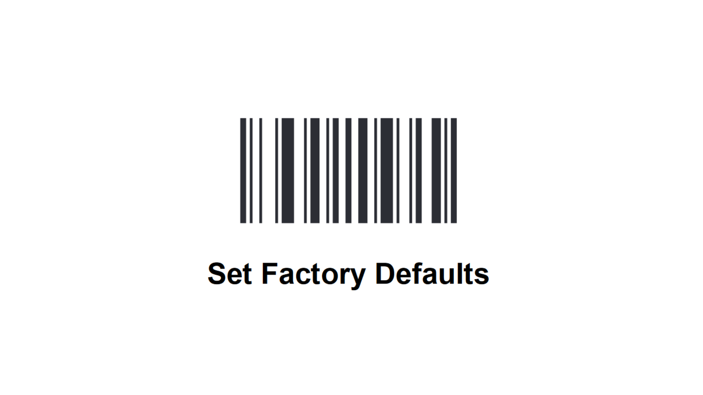

## [Rakinda LV3000U](https://www.rakinda.com/en/productdetail/83/135/95.html)

| Configure as USB Serial Port | Configure as USB Keyboard input |
|:----------------------------:|:-------------------------------:|
||

## [Zebra MS4717](https://www.zebra.com/us/en/products/oem/fixed-mount/ms4700-series.html)

| Configure as USB Serial Port | Configure as USB Keyboard input |
|:----------------------------:|:-------------------------------:|
||
